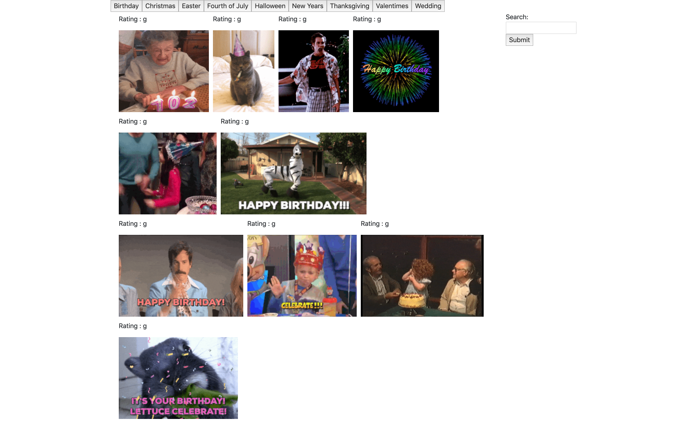

Gifhy-Api
====

Description
----

A app that allows the user to gather gifs from an api using the buttons. The gif runs by the user clicking on the still image. Lastly a user can search for gifs by the text bar at the side.

Link to the [Site](https://jetenderg.github.io/Gifhy-Api/)

Installation
----
*Clone Repository*

> git clone  https://github.com/JetenderG/Gifhy-Api.git

Built With
---
- [Bootstrap](https://getbootstrap.com/) CSS FrameWork
- [Jquery](https://jquery.com/) Javascript Library
- [Giphy](https://developers.giphy.com/) Gifhy Api

    